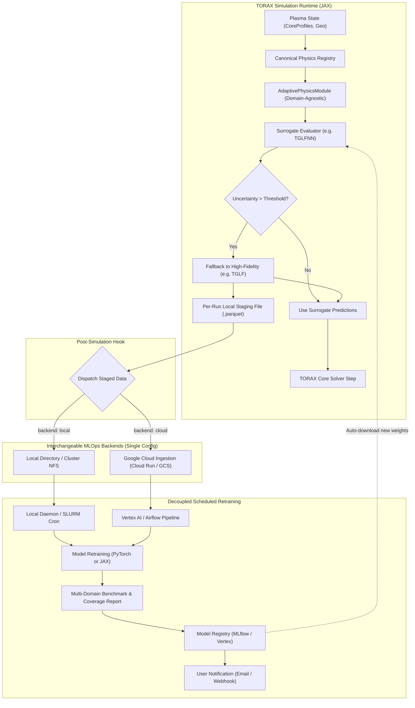
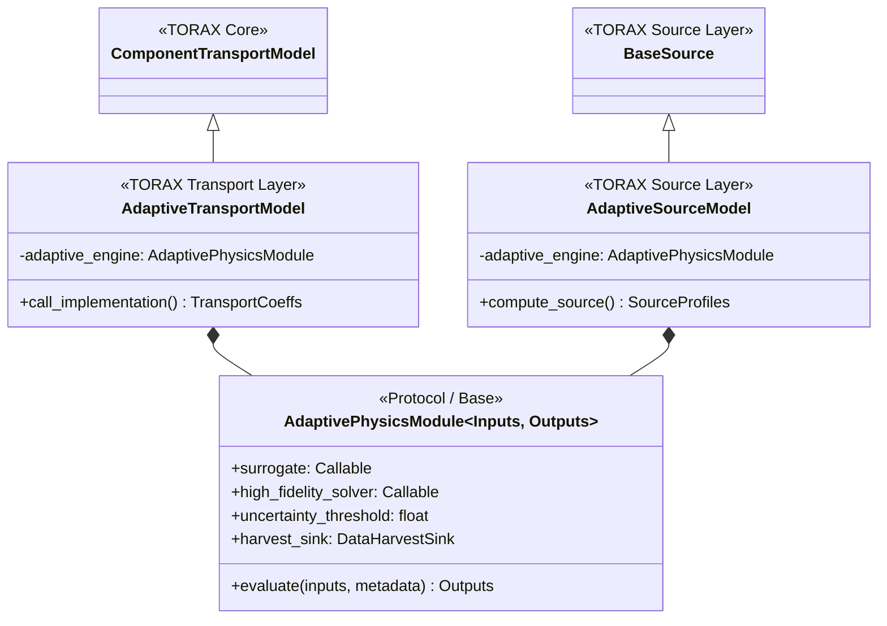
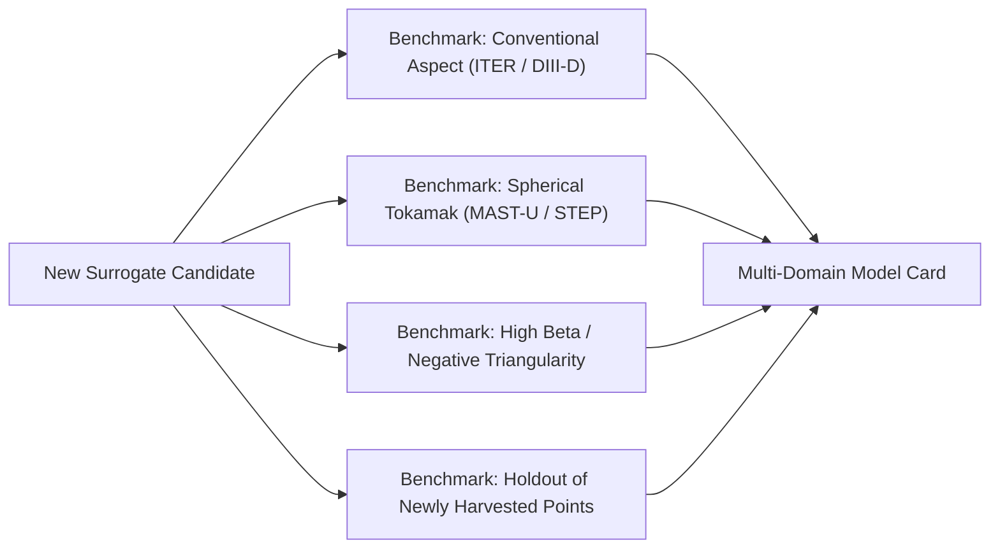

# Architecture Report: Active Learning Data Harvesting & MLOps for TORAX

This document provides a comprehensive technical blueprint for implementing **uncertainty-driven active learning, in-situ data harvesting, automated feature remapping, and an interchangeable MLOps retraining pipeline** for TORAX.

---

## 1. System Architecture Overview

The proposed design establishes a closed-loop active learning cycle that connects high-performance simulation in TORAX with automated surrogate model maintenance:



---

## 2. In-Situ Data Harvesting in TORAX

### 2.1 What Data Needs to be Harvested?
Every high-fidelity physics evaluation (e.g. TGLF) produces a self-contained record consisting of three layers:

1. **Model Inputs (Features $x$)**:
   - Standard dimensionless parameters: `RLNS_1`, `RLTS_1`, `RLTS_2`, `TAUS_2`, `RMIN_LOC`, `RMAJ_LOC`, `DRMAJDX_LOC`, `Q_LOC`, `Q_PRIME_LOC`, `XNUE`, `DEBYE`, `KAPPA_LOC`, `S_KAPPA_LOC`, `DELTA_LOC`, `S_DELTA_LOC`, `BETAE`, `P_PRIME_LOC`, `ZEFF`, `VEXB_SHEAR`.
   - Normalization bases: `Q_GB`, `GAMMA_GB`, $c_s$, $a$, $B_{\text{unit}}$.
2. **Model Outputs (Labels $y$)**:
   - Gyro-Bohm normalized fluxes: `electron_heat_flux_GB` ($Q_e$), `ion_heat_flux_GB` ($Q_i$), `electron_particle_flux_GB` ($\Gamma_e$).
3. **Numerical Configuration Metadata (Fingerprint)**:
   - Physics solver settings: `sat_rule`, `kygrid_model`, `xnu_model`, `n_modes`, `geometry_flag`, `n_basis_max`, `use_bpar`, `use_bper`, `sign_bt`, `sign_it`.
   - Plasma composition: number of species, mass ratios ($m_i / m_D$), charge states.

### 2.2 Storage Mechanism: Per-Run Local Staging
To guarantee zero thread lock contention during multi-process cluster sweeps and prevent network latency from stalling JAX execution:

- **Inside `jax.pure_callback`**:
  `TGLFTransportModel` evaluates TGLF via `tglf2py`. At the end of each callback invocation, the evaluated inputs and output fluxes are accumulated into a lightweight in-memory list or directly appended to a run-specific staging file:
  ```
  /tmp/torax_harvest_<run_uuid>.parquet
  ```
  Parquet is columnar, compressed (Snappy/ZSTD), and natively supports embedded dictionary metadata for numerical settings.
- **Post-Simulation Hook**:
  When `run_simulation()` finishes, TORAX calls a clean-up hook:
  1. Closes the local run Parquet file.
  2. Embeds summary stats (number of harvested points, simulation ID, timestamp).
  3. Dispatches the file to the active backend (local directory or cloud endpoint).

### 2.3 Metadata Compatibility Hashing
Only runs with identical numerical parameter choices may be merged for surrogate retraining. To prevent corrupted datasets:

- A canonical SHA-256 hash is computed over the sorted dictionary of numerical settings and species definitions:
  $$\text{fingerprint} = \text{SHA256}(\text{canonical\_json}(\text{solver\_settings}, \text{species\_config}))$$
- Harvested files are partitioned by this fingerprint:
  ```
  harvested_data/
    ├── tglf_sat1_3species_<hash1>/
    │     ├── metadata.json              # Human-readable parameter manifest
    │     ├── run_20260922_01.parquet
    │     └── run_20260922_02.parquet
    └── tglf_sat2_lowaspect_<hash2>/
          ├── metadata.json
          └── run_20260922_03.parquet
  ```

---

## 3. Uncertainty-Driven Active Learning Transport Model

### 3.1 Uncertainty Quantification in TGLFNN
`TGLFNNukaeaModel` uses a `GaussianMLPEnsemble` consisting of 5 estimators. When `model.predict(inputs)` is called, it outputs a dictionary containing:
```python
predictions = self.model.predict(tglfnn_inputs)
# Shape for each flux is (n_faces, 2)
# Index 0: Mean prediction
# Index 1: Variance estimate (epistemic + aleatoric uncertainty)
efi_mean = predictions["efi_gb"][..., 0]
efi_var  = predictions["efi_gb"][..., 1]
```
The standard deviation is $\sigma = \sqrt{\text{var}}$, and the relative uncertainty is $\delta = \frac{\sigma}{|\mu| + \epsilon}$.

### 3.2 Adaptive Switching Strategies
The adaptive transport model supports two configurable fallback modes:

#### Mode A: Full-Profile Fallback (Default & Recommended for PDE Stability)
- If the relative uncertainty $\delta_i$ on *any* radial face $i$ exceeds a user-configured threshold ($\delta_{\text{max}}$, e.g. $0.25$), TGLF is executed for the entire radial profile:
  ```python
  trigger_high_fidelity = jnp.any(relative_uncertainty > threshold)
  ```
- **Rationale**: Transport coefficients drive parabolic PDEs. Splicing surrogate outputs at $\rho=0.4$ with numerical solver outputs at $\rho=0.5$ can introduce artificial spatial jumps in $\chi(r)$, causing solver convergence issues unless heavily smoothed. Full-profile fallback preserves physical smoothness.

#### Mode B: Radial Face-Level Switching with Smoothing
- TGLFNN is evaluated across all faces.
- Faces where $\delta_i \le \delta_{\text{max}}$ keep surrogate outputs.
- Faces where $\delta_i > \delta_{\text{max}}$ are dispatched to TGLF.
- The spliced transport coefficients pass through TORAX's existing Gaussian kernel (`smoothing_zones` in `TransportModel`) to smooth any inter-face gradients.

### 3.3 Integration with TORAX Pydantic Architecture
In `torax/_src/transport_model/pydantic_model.py`, register the adaptive model as a valid component:

```python
class AdaptiveTGLFModelConfig(pydantic_model_base.ComponentTransportBase):
  model_name: Annotated[Literal['adaptive_tglf'], torax_pydantic.JAX_STATIC] = 'adaptive_tglf'
  surrogate_model_path: str = ''
  uncertainty_threshold: float = 0.20
  fallback_mode: Literal['full_profile', 'per_face'] = 'full_profile'
  harvest_data: bool = True
  tglf_config: tglf_transport_model.TGLFTransportModelConfig = pydantic.Field(
      default_factory=tglf_transport_model.TGLFTransportModelConfig
  )
```

---

## 4. Automated Feature Remapping (The Model Contract)

### 4.1 Current Limitation
In `tglfnn_ukaea_transport_model.py`, methods `_make_input_tensor_step()` and `_make_input_tensor_multimachine()` manually index and stack hardcoded arrays. Deploying a new surrogate trained on a different feature set currently requires manually editing TORAX source code.

### 4.2 Dynamic Feature Binding Pattern
To enable zero-code deployment of newly retrained models:

1. **Canonical Physics Registry**:
   TORAX defines a function mapping physical inputs and geometric state to a named dictionary of all computable physical quantities:
   ```python
   def get_canonical_physics_dict(tglf_inputs: TGLFInputs) -> dict[str, jax.Array]:
     return {
         **dataclasses.asdict(tglf_inputs),
         "s_hat": (tglf_inputs.RMIN_LOC / tglf_inputs.Q_LOC)**2 * tglf_inputs.Q_PRIME_LOC,
         "inv_aspect_ratio": tglf_inputs.RMIN_LOC / tglf_inputs.RMAJ_LOC,
         # ... all standardized derived quantities
     }
   ```

2. **Self-Describing Model Artifact**:
   Every trained surrogate model package declares its input requirements in its metadata:
   ```json
   {
     "model_id": "tglf-sat1_3sp_d09a-2026w38_142k-ens5_m6x512",
     "input_labels": ["RLNS_1", "RLTS_1", "RLTS_2", "TAUS_2", "RMIN_LOC", "s_hat", "XNUE", ...],
     "output_labels": ["efi_gb", "efe_gb", "pfi_gb"]
   }
   ```

3. **Dynamic Stacking**:
   Inside TORAX's surrogate transport model:
   ```python
   def _prepare_inputs(self, tglf_inputs: TGLFInputs) -> jax.Array:
     physics_dict = get_canonical_physics_dict(tglf_inputs)
     # self.model.input_labels is queried dynamically from the loaded model artifact
     return jnp.stack([physics_dict[col] for col in self.model.input_labels], axis=-1)
   ```

> [!TIP]
> **Zero-Code Model Updates**: When an MLOps pipeline publishes an updated surrogate with reordered or additional features, TORAX automatically packs the correct tensor without a single code change. If an incompatible feature is requested, TORAX fails fast at initialization before simulation starts.

---

## 5. Broadening the Pattern: Generalizing Beyond Transport

Active learning and surrogate replacement is not specific to core transport. It is generalized into a domain-agnostic architecture:



### 5.1 The Domain-Agnostic Core (`AdaptivePhysicsModule`)
`AdaptivePhysicsModule` is completely decoupled from transport physics:
1. Receives an arbitrary JAX PyTree of `inputs`.
2. Computes the surrogate mean and uncertainty.
3. Evaluates if $\text{uncertainty} > \text{threshold}$.
4. If exceeded: dispatches to the registered `high_fidelity_solver`, stages input-output pairs to the `DataHarvestSink`, and returns high-fidelity ground truth.
5. If confident: returns surrogate predictions.

### 5.2 Physics Domain Adapters in TORAX
Thin domain-specific adapters connect `AdaptivePhysicsModule` to TORAX interfaces:
- **Core Transport (`AdaptiveTransportModel`)**: Wraps `ComponentTransportModel`, mapping inputs from `CoreProfiles` and returning `TransportCoeffs`. Works for TGLF/TGLFNN and QuaLiKiz/QLKNN.
- **Heating & Current Drive (`AdaptiveSourceModel`)**: Wraps high-fidelity Fokker-Planck / ray-tracing codes (e.g. NUBEAM, TORIC) and fast neural surrogates, returning `SourceProfiles`.
- **Pedestal / Edge (`AdaptivePedestalModel`)**: Wraps high-fidelity EPED / MHD stability solvers and fast neural pedestal surrogates.
- **Impurities**: Wraps atomic physics / ADAS collisional-radiative models and neural radiation surrogates.

---

## 6. Model Versioning & Naming Conventions

Scientific surrogate models require naming conventions that encode physical assumptions, numerical configuration, data lineage, and network architecture.

### 6.1 Structured Semantic Naming Schema
Surrogate model IDs follow a 4-part descriptor:

$$\mathbf{\{PhysicsCode\}}-\mathbf{\{PhysicsFlavor\_SettingsHash\}}-\mathbf{\{DatasetLineage\}}-\mathbf{\{Architecture\}}$$

**Example**:
```
tglf-sat1_3sp_d09a-2026w38_142k-ens5_m6x512
```

- **`tglf-sat1_3sp`**: Physics solver and configuration (TGLF SAT1 with 3 species: electrons, main ions, impurities).
- **`d09a`**: 4-character hex prefix of the SHA-256 fingerprint of the numerical settings (guaranteeing exact solver reproducibility).
- **`2026w38_142k`**: Dataset lineage snapshot: Year 2026, calendar week 38, trained on a cumulative total of $142{,}000$ validated points.
- **`ens5_m6x512`**: Architecture metadata: 5-estimator Gaussian MLP ensemble, 6 hidden layers $\times$ 512 units.

### 6.2 Model Card & Coverage Manifest (`model_spec.json`)
Every model artifact is accompanied by a manifest defining its valid physical domain:
```json
{
  "model_id": "tglf-sat1_3sp_d09a-2026w38_142k-ens5_m6x512",
  "base_physics": "TGLF",
  "numerical_settings_hash": "d09a47b8e1...",
  "dataset_version": "dset_sat1_3sp_2026w38",
  "sample_count": 142000,
  "input_labels": ["RLNS_1", "RLTS_1", "RLTS_2", "TAUS_2", "RMIN_LOC", "s_hat", "XNUE", ...],
  "output_labels": ["efi_gb", "efe_gb", "pfi_gb"],
  "domain_coverage": {
    "RLTS_1": {"min": 0.0, "max": 25.0},
    "Q_LOC": {"min": 0.8, "max": 6.5},
    "KAPPA_LOC": {"min": 1.0, "max": 2.2},
    "BETAE": {"min": 0.0001, "max": 0.05}
  },
  "benchmark_scores": {
    "iter_baseline_rmse": 0.038,
    "spherical_tokamak_rmse": 0.051
  }
}
```

---

## 7. The Multi-Domain Evaluation Suite & Scientific Retraining

### 7.1 The "Golden Test Set" Fallacy in Physical Systems
In consumer machine learning, data drift is often non-stationary (user preferences drift). In tokamak physics, **the underlying physical laws do not drift**—gyrokinetics and Euler-Maxwell equations are stationary.

What changes over time is **parameter space exploration**:
- Lab A runs conventional aspect-ratio tokamaks ($A \approx 3$, ITER baseline).
- Lab B runs low-aspect spherical tokamaks ($A \approx 1.5$, MAST-U / STEP) with high ExB shear.
- The harvested data from Lab B does not invalidate Lab A; it expands the convex hull of explored physics space.

A single "golden test set" creates severe failure modes:
1. Evaluating solely on Lab A's test set will not reflect whether the surrogate learned Lab B's spherical tokamak regime.
2. If network capacity trade-offs slightly decrease accuracy on Lab A ($2.0\% \to 2.2\%$) while drastically improving Lab B ($300\% \to 3.5\%$), a naive rule like *"only deploy if it beats the previous model on the golden set"* would incorrectly reject the improved model.
3. Users focusing exclusively on ITER baseline scenarios legitimately want a model optimized specifically for that subspace.

### 7.2 Multi-Domain Benchmark Suite
Instead of a single scalar test loss, the retraining pipeline validates models against a **benchmark suite of canonical plasma regimes**:



### 7.3 Model Registry Tagging by Specialization
Rather than a single global `production` tag overwriting prior checkpoints:
- **`general_multimachine_latest`**: Trained on all cumulative data across all devices.
- **`iter_baseline_specialized`**: Pinned model prioritizing precision in conventional tokamak regimes.
- **`spherical_tokamak_specialized`**: Pinned model focused on tight aspect-ratio geometries.
- **Permanent Version Pinning**: Every historical release remains accessible by its semantic ID (e.g. `tglf-sat1_3sp_d09a-2026w38_142k-ens5_m6x512`), guaranteeing reproducibility for scientific publications.

### 7.4 Self-Guarding via Runtime Uncertainty
Because surrogate models predict their own ensemble uncertainty $\sigma$, the model automatically guards itself at runtime: if a simulation enters an unexplored region outside the model's domain, the uncertainty spike triggers high-fidelity fallback and harvests the new point for the next training cycle.

---

## 8. Interchangeable Backends via a Single Config

Users must be able to run simulations and contribute data either locally (workstation/cluster) or to Google Cloud without complex configuration files.

### 8.1 Pydantic Configuration
A clean discriminated union under `data_harvesting`:

```python
class LocalHarvestingConfig(torax_pydantic.BaseModelFrozen):
  type: Literal['local'] = 'local'
  output_directory: str = '~/torax_datasets'

class CloudHarvestingConfig(torax_pydantic.BaseModelFrozen):
  type: Literal['cloud'] = 'cloud'
  endpoint_url: str = 'https://torax-mlops.deepmind.org'
  api_key: str | None = None  # Falls back to TORAX_API_KEY env variable

class DataHarvestingConfig(torax_pydantic.BaseModelFrozen):
  enabled: bool = False
  backend: LocalHarvestingConfig | CloudHarvestingConfig = pydantic.Field(
      default_factory=LocalHarvestingConfig
  )
```

### 8.2 User Experience
To switch between local clustering and cloud sharing, the user changes a single string in their simulation config:
```python
# Option A: Save to local workstation / cluster directory
config.harvesting.backend = LocalHarvestingConfig(output_directory="/shared/fusion_data")

# Option B: Stream to Google Cloud Community Service
config.harvesting.backend = CloudHarvestingConfig()
```

### 8.3 Decoupled Execution on Local Systems
TORAX only writes harvested files to the designated directory. Retraining is decoupled:
- **Workstation**: A local cron job or systemd timer runs a training script weekly.
- **SLURM Cluster**: A standing cron job checks if new `.parquet` files exist and submits an `sbatch train_surrogate.sh` job to the cluster partition.

---

## 9. MLOps in Plain Words & Tooling Guide

For scientists and developers without prior MLOps experience, here is an explanation of core concepts and recommended tools.

### 9.1 Plain-English MLOps Concepts
- **Data Versioning**: Like Git, but for large datasets. You don't commit gigabytes of Parquet files to Git. Instead, data versioning tools create a tiny cryptographic hash tracking the exact state of the dataset used to train a model, ensuring complete reproducibility.
- **Model Registry**: A catalog of trained models. Instead of saving `.pt` or `.pkl` files with names like `model_final_v2_really_final.pt`, a registry tracks model artifacts, training parameters, evaluation loss, version tags, and deployment dates.
- **Automated Pipeline**: A scripted workflow that runs on a schedule (e.g. weekly). It pulls new data, validates it, trains the model, runs validation checks, generates a performance report, and updates the registry.
- **Input Space Coverage**: A visual comparison of the parameter hypercube or convex hull showing new territory explored by harvested points relative to the original training domain.

---

### 9.2 Tooling Comparison: Open Source vs. Google Cloud Native

| Feature | Open-Source Stack (Vendor-Neutral) | Google Cloud Native Stack |
| :--- | :--- | :--- |
| **Data Storage** | MinIO / Local Zarr / Parquet files | Google Cloud Storage (GCS) Buckets |
| **Data Versioning** | **DVC (Data Version Control)** | **Vertex AI Datasets** or BigQuery table snapshots |
| **Model Registry** | **MLflow** or Weights & Biases (W&B) | **Vertex AI Model Registry** |
| **Pipeline Runner** | **Prefect** or GitHub Actions / SLURM cron | **Vertex AI Pipelines** (Kubeflow based) |
| **Ingestion API** | FastAPI container on user's server | **Google Cloud Run** (Serverless container) |
| **Operational Overhead** | Medium (need to host MLflow server & storage) | Low (fully managed serverless infrastructure) |
| **Portability** | Runs anywhere (laptop, cluster, AWS, GCP) | Bound to Google Cloud Platform |

#### Recommendation:
- **For Local / On-Premise Use**: Use **Parquet + MLflow + SLURM / Cron**. MLflow can be run locally with a single command (`mlflow ui`) and provides a model registry, metrics logging, and artifact tracking without cloud dependencies.
- **For Google Cloud Solution**: Use **Cloud Run (Ingestion) + GCS (Storage) + Vertex AI Pipelines (Retraining & Registry)**. It requires zero server maintenance, scales to zero when idle, and provides built-in GPU allocation during retraining.

---

## 10. Community Cloud: Fair Usage & Tiered Access Models

To prevent users from "just taking" trained surrogates without contributing harvested data, the Google Cloud solution can implement one of three community access policies.

### Comparison of Fair Usage Policies

| Policy | Mechanism | Pros | Cons | Recommendation Level |
| :--- | :--- | :--- | :--- | :--- |
| **1. Embargo / Early-Access Window** | Contributing users receive immediate access to new weekly models. Non-contributing users get access after a 30-day embargo period. | • Open-science friendly<br>• Does not block academic/educational users<br>• Strongly incentivizes active labs to contribute data | • Non-contributors can still wait out the embargo | **Highly Recommended** (Standard in research data consortia) |
| **2. Credit / Token Ledger ("Give-to-Get")** | Each 100 validated physics points uploaded grants 1 credit. Downloading a new surrogate checkpoint costs $N$ credits. | • Direct, mathematically fair reciprocity<br>• Prevents freeloading completely | • Higher accounting complexity<br>• May discourage new users who don't have simulation data yet | **Viable Alternative** |
| **3. Quality-Gated Role Tiers** | Role-based permissions: *Free Tier* (access to base models, strict rate limits); *Contributor Tier* (access to weekly models & specialized fine-tunes). | • Simple to implement via API keys<br>• Allows manual grants for verified institutions | • Requires an administrator to review/approve contributor roles | **Good for Enterprise** |

---

## 11. Concrete Implementation Roadmap

### Phase 1: TORAX Core (Weeks 1–2)
1. Implement `AdaptivePhysicsModule` base and `AdaptiveTransportModel` in `torax/_src/transport_model/`.
2. Implement `get_canonical_physics_dict()` in `tglf_based_transport_model.py` and dynamic stacking in `tglfnn_ukaea_transport_model.py`.
3. Add local staging file writer (`.parquet`) to `tglf_transport_model.py` callback.
4. Update Pydantic transport configs to expose active learning parameters.

### Phase 2: Decoupled Local Pipeline (Weeks 3–4)
1. Write a standalone Python retraining script (`train_surrogate.py`) that loads Parquet batches, trains the ensemble, and logs to MLflow.
2. Provide a sample SLURM submission script and local cron configuration.
3. Validate that retrained weights load automatically into TORAX with zero code modifications using semantic IDs.

### Phase 3: Google Cloud Solution (Weeks 5–6)
1. Deploy a lightweight FastAPI ingestion endpoint on Google Cloud Run to receive completed Parquet files and write to GCS.
2. Configure a Vertex AI Pipeline for weekly scheduled retraining.
3. Implement the multi-domain benchmark evaluation suite and automated model card generation.
4. Implement the early-access embargo token validation in the Cloud Run gateway.
